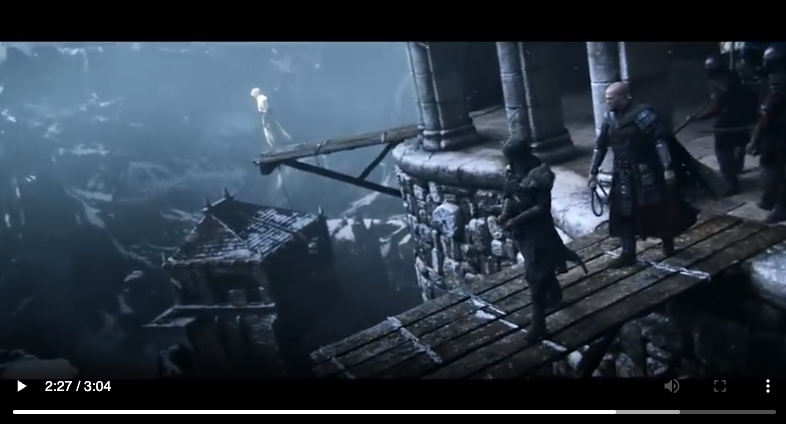

# Temporal Video Search with CLIP + Whisper

A prototype that indexes a video on two tracks — **what it looks like** and **what is being said** — into a shared CLIP embedding space, then lets you query that index with natural language to find the moments that match.

## Example

Searching for `"Assassin Altair walking on the ledge"` in the Assassin's Creed Revelations trailer:



```
Query: 'Assassin Altair walking on the ledge'
Top 5 results:

#   src    time       score   text
------------------------------------------------------------------------------
1   video  02:28.00   0.3160  [frame]
2   video  00:39.00   0.3135  [frame]
3   video  02:30.00   0.3100  [frame]
4   video  02:29.00   0.3096  [frame]
5   video  02:25.00   0.3090  [frame]
```

## How It Works

CLIP has two encoders — one for images, one for text — that map into the **same** vector space. That's the whole trick: if you embed a frame and embed the sentence "a dog on the beach," you can compare them directly with cosine similarity.

1. **`embedFrames.py`** samples frames every N seconds and runs them through CLIP's vision encoder.
2. **`embedSubtitles.py`** runs Whisper to get timestamped transcript segments, then runs each segment through CLIP's text encoder.
3. **`search.py`** encodes your query with CLIP's text encoder and does cosine similarity against both embedding files.

## Install

```bash
pip install -r Requirements.txt

# Whisper also needs ffmpeg on your PATH:
# macOS:   brew install ffmpeg
# Ubuntu:  sudo apt install ffmpeg
```

First run will download the CLIP weights (~600MB for ViT-B/32) and whichever Whisper model you pick (74MB tiny → 1.5GB large).

## Quick Start

```bash
# 1. Extract frame embeddings (1 frame per second)
python embedFrames.py video.mp4 --interval 1 --output frame_embeddings.pkl

# 2. Extract subtitle embeddings (transcribe + embed)
python embedSubtitles.py video.mp4 --output subtitle_embeddings.pkl

# 3. Search!
python search.py "your search query" --source video --top-k 10
```

## Usage

### 1. Build the Frame Index

```bash
python embedFrames.py video.mp4 --interval 1 --output frame_embeddings.pkl
```

**Options:**
- `--interval` — Seconds between sampled frames (default: 2)
  - Use `1` for action-heavy content
  - Use `5` for lectures/slow content
- `--batch-size` — Frames per batch for GPU (default: 16)
- `--model` — CLIP model (default: `openai/clip-vit-base-patch32`)

**Example output:**
```
[frames] device=cpu  model=openai/clip-vit-base-patch32
[frames] fps=24.00  total_frames=4432  duration=184.7s
[frames] embedded 176 frames
[frames] saved 185 embeddings (dim=512) -> frame_embeddings.pkl
```

### 2. Build the Subtitle Index

```bash
python embedSubtitles.py video.mp4 --whisper-model base --output subtitle_embeddings.pkl
```

**Whisper model sizes** (trade accuracy for speed):
| Model | Size | Speed | Best For |
|-------|------|-------|----------|
| `tiny` | 74MB | Fastest | Quick tests |
| `base` | 139MB | Fast | English content |
| `small` | 461MB | Medium | Non-English |
| `medium` | 1.5GB | Slow | High accuracy |
| `large` | 2.9GB | Slowest | Best accuracy |

**Example output:**
```
[subs] loading whisper: base
[subs] transcribing video.mp4
Detected language: English
[subs] 17 segments from whisper  language=en
[subs] loading CLIP: openai/clip-vit-base-patch32
[subs] embedded 17/17
[subs] saved 17 embeddings (dim=512) -> subtitle_embeddings.pkl
```

### 3. Search

```bash
# Search video frames only
python search.py "Assassin walking on ledge" --source video --top-k 5

# Search subtitles/audio only  
python search.py "discussion about physics" --source audio --top-k 5

# Search both (default)
python search.py "explosion scene" --source both --top-k 10

# Merge nearby frame+subtitle hits into single results
python search.py "the hero appears" --merge --top-k 5
```

**Options:**
- `--frames` — Path to frame embeddings (default: `frame_embeddings.pkl`)
- `--subtitles` — Path to subtitle embeddings (default: `subtitle_embeddings.pkl`)
- `--source` — `video`, `audio`, or `both` (default: `both`)
- `--top-k` — Number of results (default: 10)
- `--merge` — Combine nearby hits from different sources

**Example output:**
```
Query: 'Assassin Altair walking on the ledge'
Top 5 results:

#   src    time       score   text
------------------------------------------------------------------------------
1   video  02:28.00   0.3160  [frame]
2   video  00:39.00   0.3135  [frame]
3   video  02:30.00   0.3100  [frame]
4   video  02:29.00   0.3096  [frame]
5   video  02:25.00   0.3090  [frame]
```

## Design Notes

- **Why CLIP for subtitles instead of a sentence-transformer?** Cross-modal search requires everything in one vector space. A single query needs to retrieve both visual and spoken matches.
- **Why L2-normalize at write time?** Search becomes a plain dot product instead of normalize-then-dot per query.
- **Why pickle?** It's a prototype. Swap in FAISS or Qdrant for production use with hours of footage.
- **Model matching:** Frame file, subtitle file, and search query must all use the same CLIP model. `search.py` warns if they don't match.

## File Layout

```
video-reader-local/
├── embedFrames.py        # CLIP image embeddings from sampled frames
├── embedSubtitles.py     # Whisper transcription + CLIP text embeddings
├── search.py             # Cosine similarity search
├── Requirements.txt
├── README.md
└── example.png           # Example search result
```
